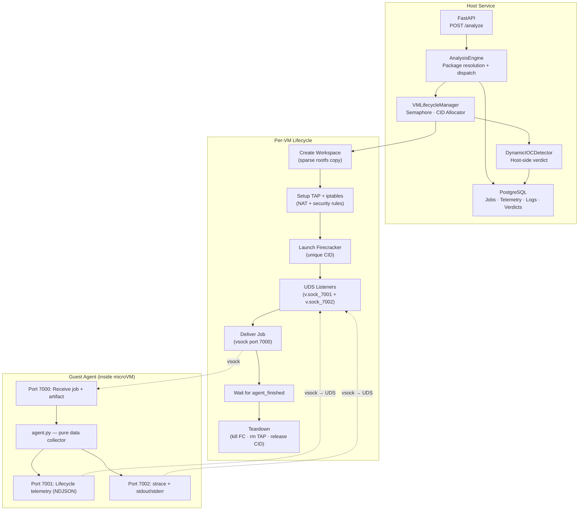

# MicroVM Dynamic Analysis Service

Production-ready Python 3.12 microservice for dynamic malware analysis of npm and PyPI packages inside Firecracker microVMs. Acts as the **third layer** in the SentinelFlow classification pipeline (after typosquatting detection and static AST/entropy analysis).

## Architecture



## Vsock Communication Protocol

| Port | Direction | Purpose | Format |
|------|-----------|---------|--------|
| 7000 | Host → Guest | Job header + artifact binary | JSON line + raw bytes |
| 7001 | Guest → Host | Agent lifecycle telemetry | NDJSON |
| 7002 | Guest → Host | strace output + process stdout/stderr | Plain UTF-8 text |

**Handshake**: On ports 7001/7002, the guest sends `CONNECT {port}\n` and the host replies `OK {port}\n` before data flows.

## Key Design Decisions

- **Host-side verdict**: The guest agent is a pure data collector. It streams raw strace/log lines to the host. The host's `DynamicIOCDetector` interprets the evidence and computes the verdict. This prevents in-VM malware from tampering with results.
- **Parallel VMs**: Each concurrent VM gets a unique CID (from a pool) and its own TAP device with isolated networking. No CID collisions.
- **TAP networking**: VMs have internet access (for `pip install`/`npm install` from index) but are blocked from scanning private networks via iptables rules.
- **PostgreSQL mandatory**: All jobs, telemetry, logs, and verdicts are persisted to PostgreSQL.

## Project Layout

```
app/
├── main.py                          # FastAPI app with lifespan
├── api/routes.py                    # POST /analyze, health, metrics
├── core/config.py                   # Unified settings (pydantic-settings)
├── core/auth.py                     # Optional bearer auth
├── models/contracts.py              # Pydantic v2 request/response
└── services/
    ├── analysis_engine.py           # Orchestration + PostgreSQL persistence
    ├── ioc_detector.py              # DynamicIOCDetector (host-side)
    ├── package_resolver.py          # PyPI/npm artifact download
    ├── persistence.py               # PostgreSQL (mandatory)
    ├── risk.py                      # Risk score normalization [0,1]
    ├── telemetry.py                 # Telemetry dataclass
    └── sandbox/
        ├── base.py                  # SandboxRunner ABC
        ├── firecracker.py           # Firecracker sandbox runner
        ├── generic.py               # Deterministic fallback
        └── vm_lifecycle.py          # CID alloc, TAP, FC lifecycle
real_agent.py                        # Guest agent (copy into rootfs)
init                                 # Guest /sbin/init script
```

## IOC Detection

The `DynamicIOCDetector` scans every strace/log line from the VM and detects:

| Category | Examples |
|----------|----------|
| **Network** | Public IP connections, suspicious ports (4444, 6667, 31337) |
| **Process** | Shell download chains (wget\|curl + chmod +x), reverse shells |
| **File** | Sensitive reads (/etc/shadow, .ssh/authorized_keys, crontabs) |
| **DNS** | Exfiltration via very long subdomain labels |
| **Crypto** | Miner process names (xmrig, stratum+tcp://) |
| **Data staging** | tar+curl pipelines, base64 encoding of /etc/* |

## Run Locally (WSL2)

### Prerequisites

1. WSL2 with KVM support
2. Firecracker binary + kernel + rootfs (golden image with Python, Node, pip, npm, strace)
3. PostgreSQL (via docker or locally)

### Setup

```bash
# 1. Start PostgreSQL
docker run -d --name pg -e POSTGRES_DB=dynamic_analysis \
  -e POSTGRES_USER=analysis -e POSTGRES_PASSWORD=analysis \
  -p 5432:5432 postgres:16-alpine

# 2. Copy agent into rootfs
cd ~/firecracker-workspace
sudo mount rootfs.ext4 /tmp/my-rootfs
sudo cp /mnt/e/Licenta/MicroVMService/real_agent.py /tmp/my-rootfs/opt/agent.py
sudo cp /mnt/e/Licenta/MicroVMService/init /tmp/my-rootfs/sbin/init
sudo chmod +x /tmp/my-rootfs/sbin/init
sudo umount /tmp/my-rootfs

# 3. Configure and run
cd /mnt/e/Licenta/MicroVMService
source .venv-wsl/bin/activate
export $(cat .env | xargs)
uvicorn app.main:app --host 0.0.0.0 --port 8080
```

### Test Analysis

```bash
# With artifact
curl -X POST http://localhost:8080/analyze \
  -H "Content-Type: application/json" \
  -d '{
    "ecosystem": "pypi",
    "package_name": "evil-package",
    "package_version": "0.9.0",
    "sandbox_type": "firecracker"
  }'

# Generic sandbox (no VM)
curl -X POST http://localhost:8080/analyze \
  -H "Content-Type: application/json" \
  -d '{
    "ecosystem": "pypi",
    "package_name": "requests",
    "package_version": "2.32.3",
    "sandbox_type": "generic"
  }'
```

## Docker Compose (Production)

```bash
docker compose up --build
```

Mounts `/dev/kvm`, runs in privileged mode for TAP/iptables, PostgreSQL with health checks.

## SentinelFlow Integration

```
DYNAMIC_ANALYSIS_PROVIDER=remote
DYNAMIC_ANALYSIS_REMOTE_URL=http://<host>:8080/analyze
DYNAMIC_ANALYSIS_TIMEOUT_MS=120000
DYNAMIC_ANALYSIS_BEARER_TOKEN=<token>
```

## WSL2 OverlayFS / Rootfs Performance Notes

Firecracker requires a **raw block device** (ext4 image file) as rootfs. OverlayFS operates at the filesystem level and cannot directly replace the block device copy. For production performance:

1. **Current approach**: `cp --sparse=always` (fast on Linux, skips zero blocks)
2. **Production**: Use **device mapper snapshots** (`dmsetup create ... snapshot ...`) for instant CoW
3. **Alternative**: Use a btrfs/xfs filesystem with `cp --reflink=auto` for instant copies

For building the golden image on WSL2:
```bash
# Create a minimal rootfs with debootstrap
sudo debootstrap --include=python3,python3-pip,nodejs,npm,strace,iproute2 \
  bookworm /tmp/rootfs-build

# Create the ext4 image (size to fit)
dd if=/dev/zero of=rootfs.ext4 bs=1M count=2048
mkfs.ext4 rootfs.ext4
sudo mount rootfs.ext4 /tmp/rootfs-mount
sudo cp -a /tmp/rootfs-build/* /tmp/rootfs-mount/
sudo cp real_agent.py /tmp/rootfs-mount/opt/agent.py
sudo cp init /tmp/rootfs-mount/sbin/init
sudo chmod +x /tmp/rootfs-mount/sbin/init
sudo umount /tmp/rootfs-mount
```

## Test

```bash
pytest -q
```
